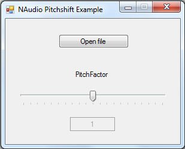

# NAudio-Pitchshifter

A realtime C# audio pitch shifter based on S. M. Bernsees phase vocoder that implements an NAudio ISampleProvider.

Or in simple words: this lets you change the pitch of audio (e.g. in realtime playback using the NAudio library).

UPDATE: contributed the newest version to NAudio, where it is now included from V1.8 on:
https://github.com/naudio/NAudio/blob/master/NAudio/Wave/SampleProviders/SMBPitchShiftingSampleProvider.cs

Test application screenshot:

________________________________________________________________________________________

Usage

________________________________________________________________________________________

Imports NAudio.Wave

// Choose FFTSize and Osamp. (recommended are 4096 and 4)
// Define Pitch shifting factor. (0.5f pitches one octave down, 2f would pitch one octave up)

Sub Test()

  SMBPitchShiftingSampleProvider SMB = new SMBPitchShiftingSampleProvider(new AudioFileReader(@"C:\Test.wav"), 4096, 4L, 0.5f);

  WaveOutEvent wo = new WaveOutEvent
  {
    DesiredLatency = 150,
    NumberOfBuffers = 3
  };

  wo.Init(new SampleToWaveProvider16(SMB));

  wo.Play();
  
End Sub
